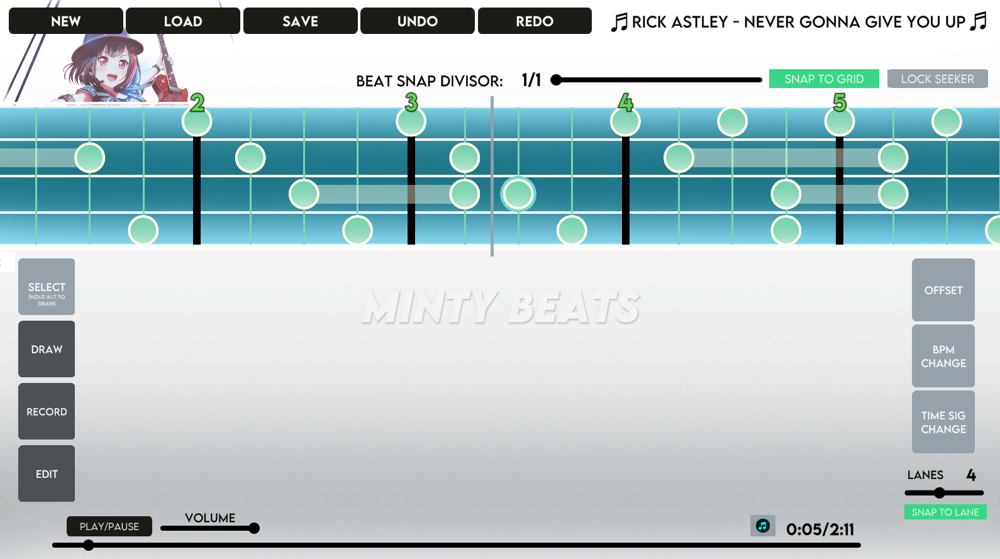

# Welcome to Minty Beats!

Minty Beats is a general-purpose beatmap editor. Specify when events should occur relative to music. The program outputs a JSON file.

* Supports mid-song **BPM/Time signature changes**!
* **Record** keystrokes in real-time to create nodes on the beatmap!
* Edit node **metadata** to specify additional event properties!
* **Deserialize** and **convert** the beatmap data to whatever beatmap data structure you're using!

## Installation
Install the Unity build for your operating system. If you want to deserialize the JSON beatmaps created with this program, also import the **Dependencies** folder into your Unity project.

## Who is this made for?
This program is best used for **rhythm game prototypes**, **non-rhythm games where gameplay syncs with music non-trivially**, or **DDR clones** (i.e.  games where things fall in lanes and you hit them at the right time). For full-fledged rhythm games with more complex mechanics, you can use Minty Beats for prototyping in early stages of development. But I highly recommend making your own beatmap editor where you can visualise gameplay in real time - especially if you plan to ship a custom beatmap editor with your game. I am happy to help anyone with this.

## Functionality
### Toolbar Mode
| Mode | Description |
| ------------- | ------------- |
| **SELECT**  | Move nodes around. Hold **ALT** to temporarily enter **DRAW** mode. |
| **DRAW**  | Click on the timeline to place a node. Right click to delete nodes. |
| **RECORD** | Press **R** to input nodes as the song is playing. Use the keys **1-8** to create long nodes and **F1-F8** to input short nodes. |
| **EDIT** | Click on a node to bring up a menu to edit its metadata. *All nodes are naturally endowed with **time**, **height**, and **duration** data. If these are insufficient for your purposes, you can add extra data to nodes.* |

### Timeline Options
| Option | Description |
| ------------- | ------------- |
| **SNAP TO GRID**  | Nodes placed on the timeline using the **RECORD** or **DRAW** tools are snapped to the vertical lines on the timeline. |
| **BEAT SNAP DIVISOR**  | When **SNAP TO GRID** is enabled, the **BEAT SNAP DIVISOR** value controls how many times each beat is subdivided. I recommend against going above 8 for most games. For other tuplet options, just temporarily change the time signature. |
| **LOCK SEEKER**  | Centers the seeker. The timeline will move as the music plays. |
| **LANES**  | Controls how many horizontal lines are drawn on the timeline. |
| **SNAP TO LANE**  | All new nodes placed will be snapped between the horizontal lines on the timeline. |

### Songplayer

| Option | Description |
| ------------- | ------------- |
| **PLAY/PAUSE**  | Self-explanatory. |
| **VOLUME**  | Self-explanatory. |
| **Music Icon**  | When enabled, a beep plays at every beat. Use this to assist in determining offsets and BPM changes. *It is recommended that you know the BPM changes and offsets of the song in advance*. |

### Flags
Flags indicate changes in the rhythm of the music. Each beatmaps starts with an **OFFSET** flag - place this flag at the start of the first bar of the music. If your music has an anacrusis and you want to keep your bar numbers consistent, you can create another **OFFSET** flag and place it at the beginning of "bar 0".

Click on the flag buttons to create a flag at the current seeker position. Right click on flags to delete them.
| Flag  | Description |
| ------------- | ------------- |
| **OFFSET**  | Resets the bar number count and starts a new bar.  |
| **BPM CHANGE**  | Changes the current BPM.  |
| **TIME SIGNATURE CHANGE**  | Changes the current time signature. *Note: we use the convention that e.g. 4/8 at 120BPM is equivalent to 4/4 at 240BPM.*  |

### Input
Changing keybinds is currently not supported.

| Key  | Description |
| ------------- | ------------- |
| **CTRL + Z**  | Undo. |
| **CTRL + Y**  | Redo. |
| **SPACEBAR**  | Play/pause the song. |
| **ALT**  | While using the **SELECT** tool, holding **ALT** will temporarily switch to the **DRAW** tool.   |
| **S**  | Set the timeline position to the seeker and lock the seeker to the center until it is moved manually.  |
| **R**  | Start recording.  |
| **Alpha 1-8**  | Create nodes on the timeline when recording. Hold to create nodes with duration. If **SNAP TO GRID** is enabled, nodes will snap to the vertical gridlines. |
| **F1-F8**  | Same as above, but holding does nothing. |
| **Right Click**  | Delete nodes while using the **DRAW** tool. |
| **Scroll**  | Moves the song/seeker forward/backward. |
| **Shift + Scroll**  | Toggles horizontal zoom of the timeline (vertical zoom currently not supported). |

## Deserialization and Conversion
Import the **Dependencies** directory into your Unity project. Write your own deserializer with ``JSONUtility`` or use the included ``SerializationManager.Load<LevelData>(string JSONString)`` to deserialize the JSON file to the ``LevelData`` class. Then convert the ``LevelData`` data into whatever data structure you are using. If you find this process particularly tedious, I would love to hear your feedback on what tools I can make to streamline this process.

## How to make a Rhythm Engine
You can ask me or steal the source code of one of the games below (might fill in this section in more detail later).

### What is a Beatmap?
A beatmap is a list of events that correspond to an audio file. Events must contain time data - this specifies when the event occurs relative to the audio file. Events may contain other data too. Duration and one-dimensional position are very common pieces of data.

### How do you Sync Events with Music?
You probably want to achieve one of the following:

1. Fire an event at certain points in the music.
2. Upon user input, check how close they were to an event relative to the music.

Very fundamentally speaking, syncing is all about keeping track of the previous event and the next event you're interested in. In the first case, you can just keep track of the next event. In the second case, you need to keep track of both the previous and next event, and remove events from an "interested" list upon user input. Keep track of references to event objects as opposed to primitives (i.e. floats) for event times.

### The Lag Question
- Limit FPS.
- For bullet hells, you can calculate the entire trajectory of each bullet instead of letting the game engine's movement handle it *ad-hoc*.
- For classic rhythm games (e.g. DDR clones), don't do anything fancy; you will probably get it right on your first attempt. Be as strict as possible with lag's effects on hit accuracy.
- For online games, do everything client-side obviously. Look up the history of cheating in *osu!*.

## Games
Here are some games that use beatmaps created with some iteration of Minty Beats. The source code of all these games are on my GitHub.

- [Weekday Warrior](https://xinmi.itch.io/weekday-warrior), a Vampire Survivors clone where you shoot bullets to the rhythm of the music.
- [Starfunk Fever](https://radetzky.itch.io/starfunk-fever) - absorb all the instruments that shoot bullets to the rhythm of the music.
- [Hare Runner](https://crychair.itch.io/harerunner), a melee bullet hell where, you guessed it, enemies shoot bullets to the rhythm of the music. *We used FMOD for some aspects of this game. FMOD is pretty trash for rhythm games and was clearly not designed for them*.
- [Campfire Friends](https://radetzky.itch.io/campfire-friends), a sort of DDR clone. Press keys corresponding to the right materials at the right time.
